# Задача "Исследование JVM через VisualVM"

### Результат работы программы:
```
Please open 'ru.netology.JvmExperience' in VisualVm
00:55:11.695989800: loading io.vertx // Здеcь идёт загрузка классов из пакета io.vertx в Metaspace

00:55:12.357613: loaded 529 classes // Загрузилось 529 классов
```
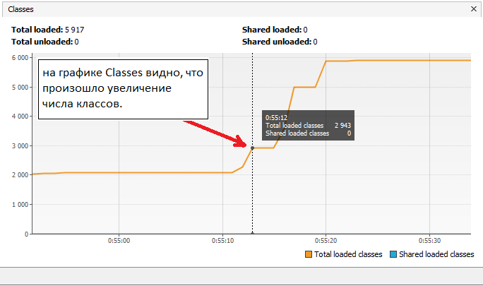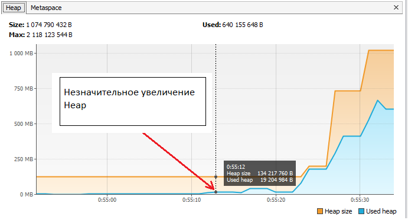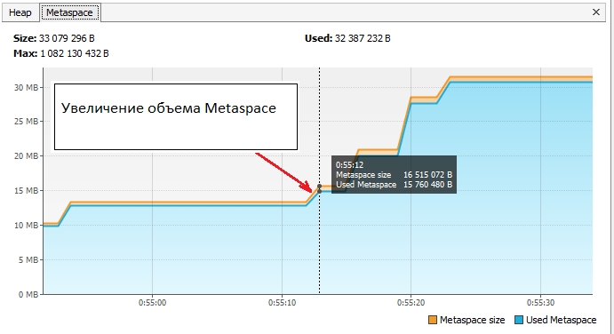
```
00:55:15.377959300: loading io.netty // Загрузка классов из пакета io.netty в Metaspace

00:55:16.466338600: loaded 2117 classes // Загрузилось 2117 классов
```
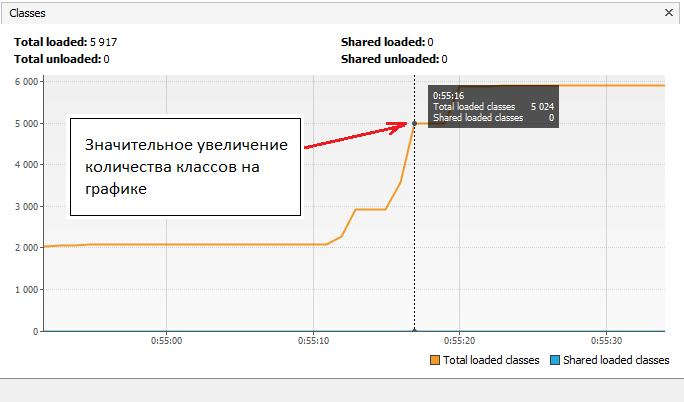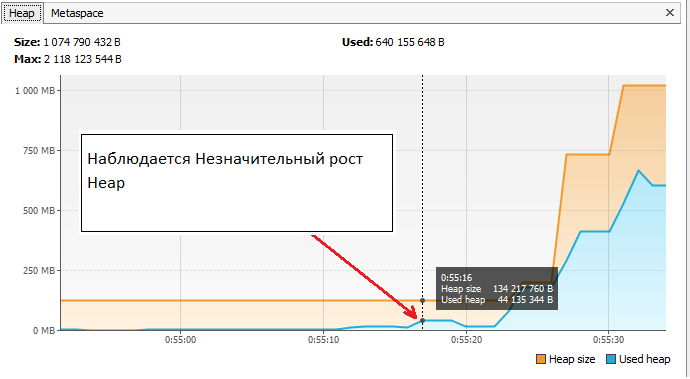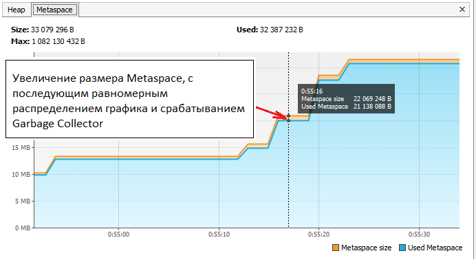
```
00:55:19.470951700: loading org.springframework // Загрузка классов из пакета org.springframework в Metaspace

00:55:19.884718700: loaded 869 classes // Загрузилось 869 классов
```
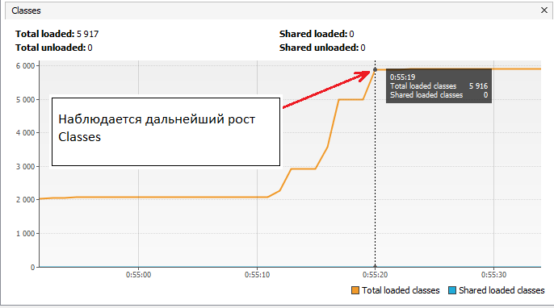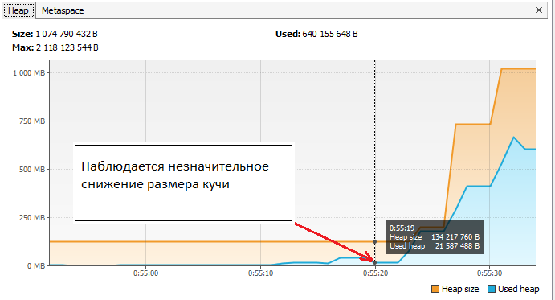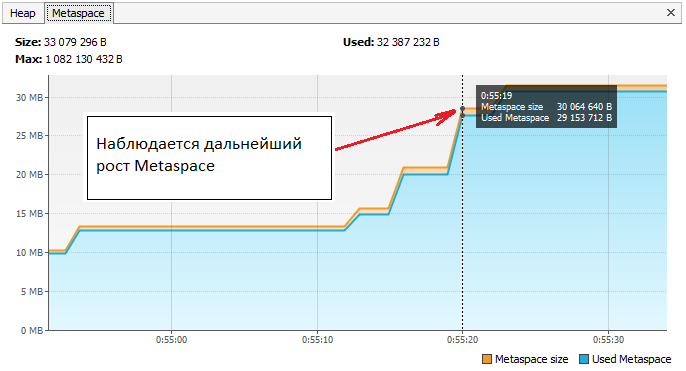
```
00:55:22.892138900: now see heap // Этап тестирования heap

00:55:22.894144200: creating 5000000 objects // Создание 5млн. объектов

00:55:23.549770200: created // Создано 5млн. объектов
```
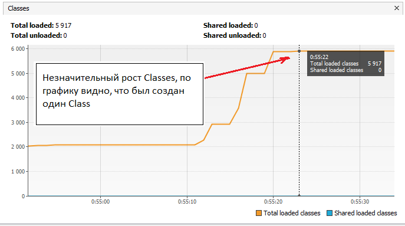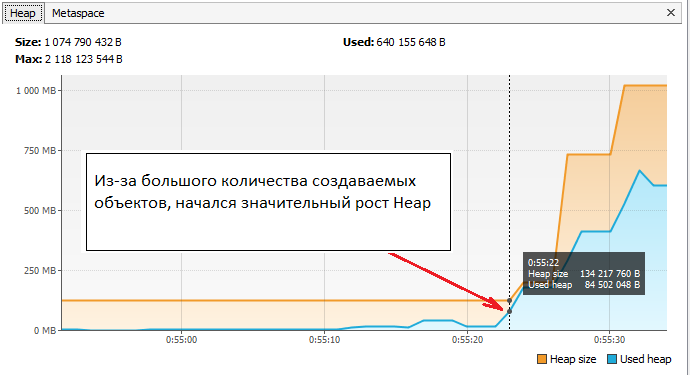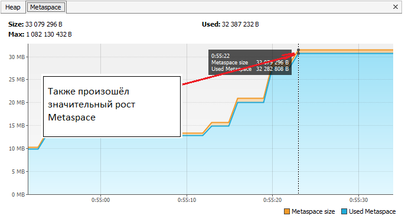
```
00:55:26.566572400: creating 5000000 objects // Повторное создание 5млн. объектов

00:55:27.232191400: created // Создано 5млн. объектов
```
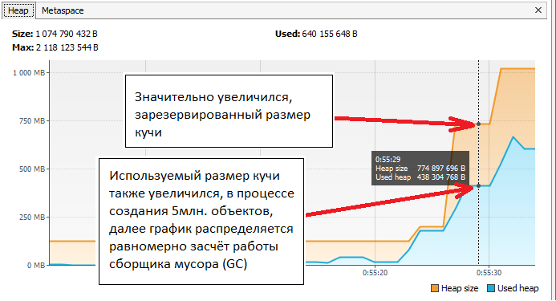
```
00:55:30.456683600: creating 5000000 objects // Повторное создание 5млн. объектов

00:55:31.321195700: created // Создано 5млн. объектов
```
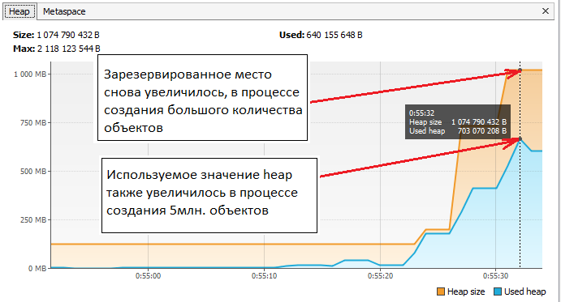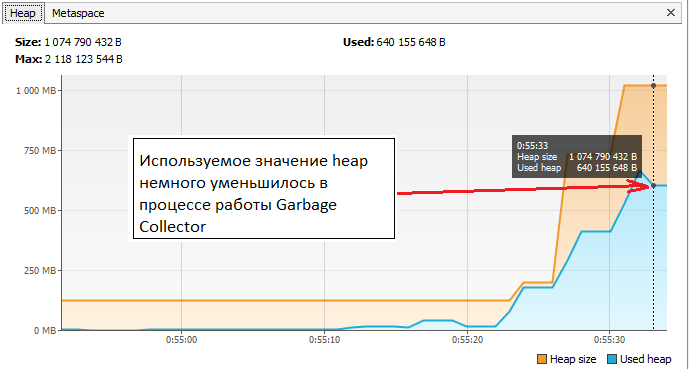
```
Process finished with exit code 0 // Завершение работы программы
```